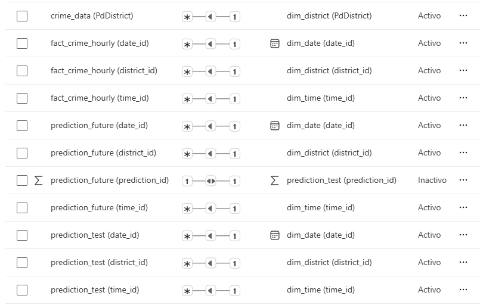
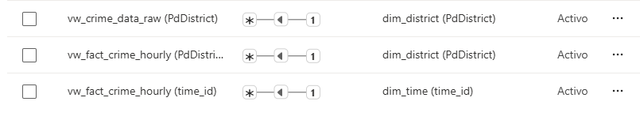

# Eliminar cualquier contenedor existente
docker compose down -v

# Iniciar los contenedores en segundo plano
docker-compose up -d

# Esperar a que los contenedores estén listos
En docker revisa que el contenedor init-db y haya terminado, deberá salir algo así:

```
2025-07-13 14:49:58 Waiting for SQL Server to be ready...
2025-07-13 14:50:08 Initializing database...
2025-07-13 14:50:08 Changed database context to 'CrimeData'.
2025-07-13 14:50:31 
2025-07-13 14:50:31 (1762311 rows affected)
2025-07-13 14:50:33 
2025-07-13 14:50:33 (1762311 rows affected)
2025-07-13 14:50:34 
2025-07-13 14:50:34 (4515 rows affected)
2025-07-13 14:50:34 
2025-07-13 14:50:34 (24 rows affected)
2025-07-13 14:50:34 
2025-07-13 14:50:34 (10 rows affected)
2025-07-13 14:50:39 
2025-07-13 14:50:39 (695398 rows affected)
```

# Instalar python venv
python -m venv venv

# Activar el entorno virtual
source venv/bin/activate

# Instalar las dependencias del proyecto
pip install -r requirements.txt

# Ejecutar script para predecir y cargar a la base de datos el flujo vehicular
python predict_and_load_data.py

# Abrir el dashboard en Power BI Desktop

# Relaciones




# Entendimiento del proyecto

Se busca predecir la cantidad de crimenes por distrito, fecha y hora en los distritos policiales de SanFrancisco, con modelos de forecasting como SARIMA y LSTM. El proyecto utiliza un dataset de Kaggle que contiene datos históricos de crímenes en San Francisco, y se centra en la predicción de la cantidad de crímenes por distrito y fecha, en lugar de clasificar el tipo de crimen.
https://www.kaggle.com/c/sf-crime (originalmente se quería clasificar el tipo de crimen, pero se decidió predecir la cantidad de crímenes por distrito y fecha).

El flujo de trabajo del proyecto es el siguiente:
1. **Inicialización de la base de datos**: Se utiliza un contenedor Docker para inicializar una base de datos SQL Server con los datos históricos de crímenes.
2. En el notebook `final.ipynb`, se realiza un análisis de los datos, se crean variables exógenas y se entrenan, evaluan y exportan los modelos de forecasting.
3. **Predicción y carga de datos**: El script `predict_and_load_data.py` se encarga de predecir la cantidad de crímenes por distrito y fecha utilizando los modelos entrenados en la carpeta `models_to_use`, y cargar los resultados en la base de datos SQL Server.
4. **Visualización de resultados**: Se utiliza Power BI para visualizar los resultados de las predicciones y el análisis de los datos.

# Cosas a mejorar si vasa tomar este proyecto

- Implementar las clases para implementar los modelos SARIMA y LTSM, las que están en el código probablemente no funcionen.
- Manejo de predicciones ya existentes en prediction_test y prediction_future. EL script predict_and_load_data.py no maneja las predicciones ya existentes, por lo que si se ejecuta varias veces probablemente se duplicarán los datos.
- Factorizar funcionalidades como la creación de las variables exógenas entre el notebook y el script predict_and_load_data.py.
- Implementar la ejecución de predicciones en las clases de los modelos, para que se pueda ejecutar el script predict_and_load_data.py sin tener que modificarlo. Esto para centralizar la lógica de cada modelo y facilitar la implementación de nuevos modelos.
- Hacer una interfaz de usuario para predict_and_load_data.py y para las funciones de entrenar modelos por distrito, para seleccionar que modelo se quiere ejecutar, y así los inutiles de tus compañeros´al menos puedan ayudarte a entrenar y ejecutar los modelos.
- Mejorar el dashboard de Power BI, con mapas y visualizaciones más interesantes.
- El docker compose debería esperar a que init_db termine, luego se podría ejecutar el script predict_and_load_data.py automáticamente.

## Errores

- La implementación de los modelos SARIMA y LSTM no está completa, por lo que es probable que no funcionen correctamente.  Esto es tanto en el notebook `final.ipynb` como en el script `predict_and_load_data.py`. Se recomienda implementar las clases correspondientes para cada modelo y ajustar los parámetros según sea necesario.
- En la dim_fecha los siguientes atributos son mejor calcularlo directamente en PowerBI.

- `month_name`
- `day_of_week`
- `week_number`

Esto es dado a que `predict_and_load_data.py` llenan los datos de la tabla dim_fecha cuando no existe la fecha en los datos originales (por ejemplo al predecir el futuro). Si quieres tmb se puede calcular esto en `ensure_dim_date` (`predict_and_load_data.py`), pero por tiempo se hizo directamente en Power BI.
- El codigo está muy mal estructurado, no se siguió un patrón de diseño claro y las clases no están bien definidas. Se recomienda refactorizar el código para mejorar su legibilidad y mantenibilidad.

## Notas

- Usa la db que se te de la gana, se usó SQL Server porque Microsoft es una perra codiciosa que te obliga a usar su software.
- Recomiendo *fuertemente* que antes de hacer nada evalues cada uno de los 5 modelos en el distrito SOUTHERN. Si el mejor modelo que obtengas tiene un MAPE lamentable (menos del 30%), entonces preparate para bajar pepita con tu profe. Una opción es en lugar de agrupar los registros por distrito-fecha-hora, solo agrupar por fecha-hora.
- Además también recomiendo medir cuanto tiempo tardo cada modelo con SOUTHERN, ese es el distrito que más tiempo va a tardar. Si se sigue el flujo de trabajo del proyecto como estaba pensado, tendrás que entrenar 9 veces cada modelo. Eso sin contar el backtesting que cuenta como entrenarlo unas 10 veces.
- El dataset de Kaggle tiene un tamaño considerable, capaz descartando años muy antiguos se puede reducir el tamaño del dataset y mejorar los tiempos de entrenamiento.
- Si algún grafico no muestra datos seguramente falte alguna relación, recuerda relacionar todo con `dim_date`.