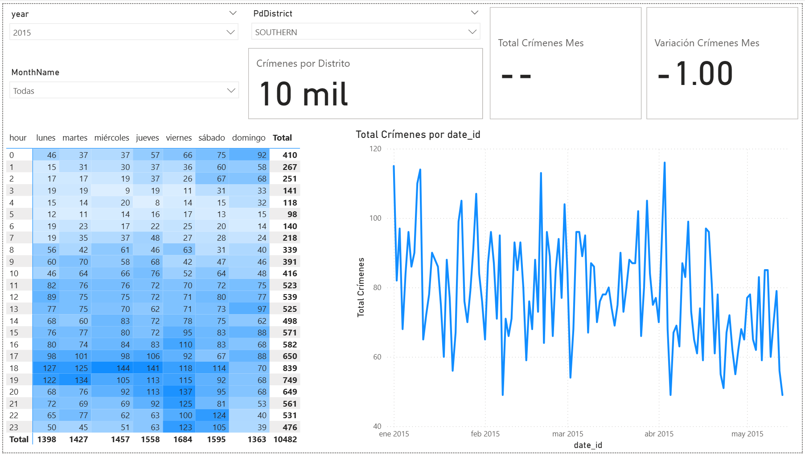
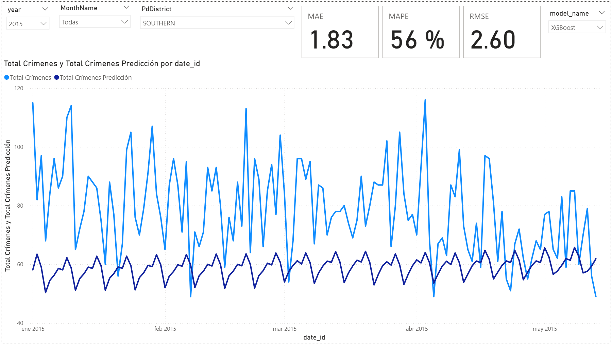
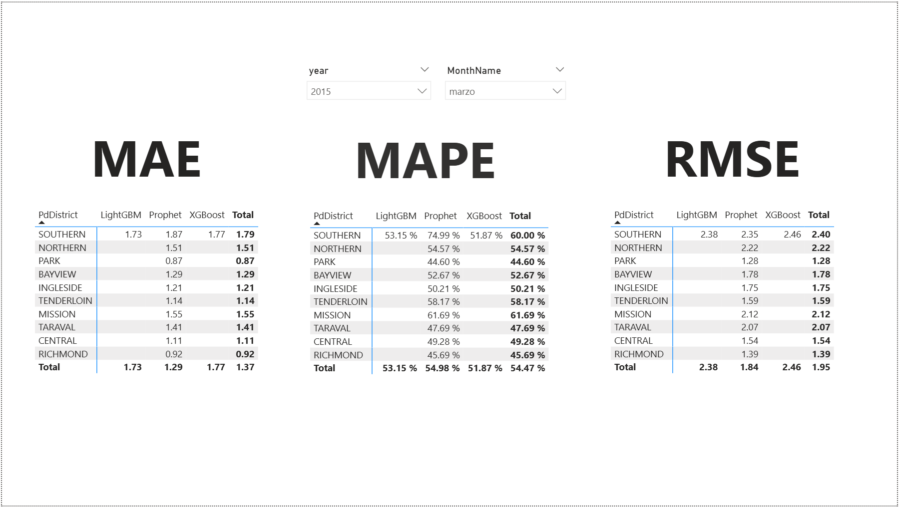
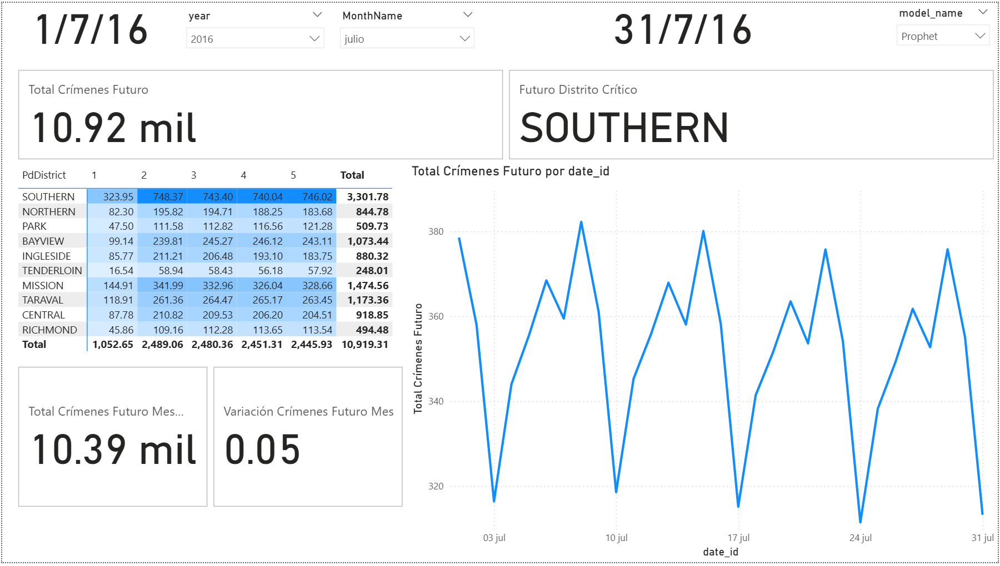
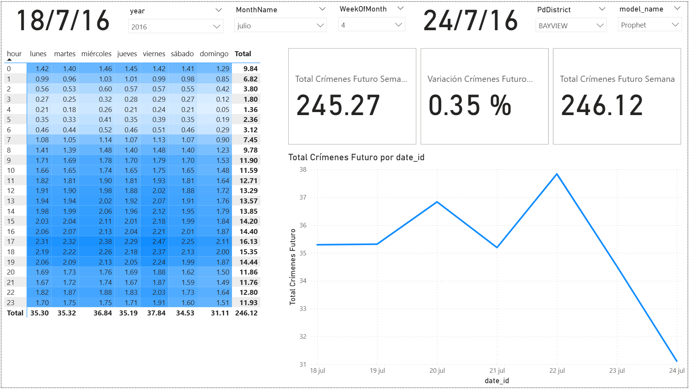

# 🚓 SF Crime Analytics: Pipeline de Predicción y Análisis de Seguridad

[](https://powerbi.microsoft.com/)
[](https://www.python.org/)
[]()
[]()

> **Solución integral de Business Intelligence que combina un pipeline ETL en Python y modelos de Machine Learning para predecir la incidencia delictiva y optimizar la asignación de recursos policiales.**

---

## 📋 Resumen Ejecutivo

Este proyecto aborda el desafío de la asignación eficiente de recursos de seguridad pública en la ciudad de San Francisco. Mediante el análisis de datos históricos y la implementación de modelos predictivos, se desarrolló un sistema que no solo visualiza lo que ocurrió, sino que **pronostica dónde y cuándo ocurrirán futuros incidentes**.

La arquitectura desacopla el procesamiento pesado (realizado en Python) de la capa de presentación (Power BI), permitiendo un análisis fluido sobre millones de registros.

---

## 🏗️ Arquitectura de Datos (End-to-End)

El flujo de datos sigue una arquitectura moderna de Analytics Engineering:

1.  **Ingesta & ETL (Python):** Script automatizado que extrae los datos crudos, normaliza fechas y gestiona valores nulos.
2.  **Machine Learning Engine:**
    * Entrenamiento de modelos competitivos (**XGBoost, LightGBM, Prophet**).
    * Generación de predicciones a futuro (Forecasting) a nivel distrito y hora.
3.  **Data Warehouse (SQL):** Almacenamiento estructurado de hechos históricos y predicciones en un esquema Relacional.
4.  **Visualización (Power BI):** Conexión a la DB para visualización interactiva y cálculo de medidas DAX complejas.

---

## 📊 Dashboards y Módulos de Análisis

### 1. Análisis Histórico y Patrones Temporales
Visión general de la criminalidad histórica. Incluye **Heatmaps (Mapas de Calor)** que cruzan *Día de la Semana vs. Hora*, identificando patrones críticos (ej. Viernes 18:00 hrs) para la planificación de patrullaje.


### 2. Validación de Modelos (Backtesting)
Módulo técnico para evaluar la fiabilidad del sistema. Compara la curva de **Datos Reales vs. Predicción**, demostrando la capacidad del modelo para capturar la estacionalidad semanal.
* **KPIs de Error:** MAE (1.83) y RMSE (2.60) para transparencia en la precisión.


### 3. Benchmarking de Algoritmos
Comparativa de rendimiento entre diferentes arquitecturas de ML (LightGBM, Prophet, XGBoost) desglosado por distrito.
* *Insight:* Permite seleccionar el modelo óptimo según la métrica de negocio prioritaria (MAPE vs RMSE).


### 4. Forecasting Operativo (Predicción Futura)
El valor central del proyecto. Tableros que proyectan la demanda de seguridad futura.

* **Mensual:** Identificación de "Distritos Críticos" (ej. SOUTHERN) para asignación de presupuesto mensual.
  
  

* **Semanal:** Planificación táctica día por día y hora por hora para la semana entrante.
  
  

---

## 🛠️ Stack Tecnológico

### Data Engineering & Data Science
* **Python (Pandas/NumPy):** Limpieza de datos y Feature Engineering (creación de variables temporales).
* **Scikit-learn / XGBoost / Prophet:** Entrenamiento de modelos de regresión y series de tiempo.
* **SQLAlchemy:** ORM para la inyección eficiente de datos procesados a la base de datos.

### Business Intelligence (Power BI)
* **Data Modeling:** Diseño de esquema Estrella (Star Schema) para optimizar el rendimiento de consultas.
* **DAX (Data Analysis Expressions):** Medidas calculadas para variaciones porcentuales (`VAR`, `CALCULATE`, `TIME INTELLIGENCE`).
* **UX/UI:** Diseño de reportes navegables y filtros dinámicos.

---

## ⚙️ Instalación y Ejecución

Para replicar este entorno de análisis:

1.  **Clonar el repositorio:**
    ```bash
    git clone [https://github.com/DivorcedLance/sf-crime-analytics.git](https://github.com/DivorcedLance/sf-crime-analytics.git)
    ```

2.  **Configurar Entorno Python:**
    ```bash
    pip install -r requirements.txt
    ```

3.  **Ejecutar Pipeline ETL:**
    Este script procesa el dataset `csv`, entrena los modelos y puebla la base de datos SQL.
    ```bash
    python src/etl_pipeline.py
    ```

4.  **Visualizar en Power BI:**
    Abrir el archivo `SFCrime_Dashboard.pbix` y actualizar las credenciales de la base de datos local.

---

## 📈 Impacto del Proyecto

* **Toma de decisiones basada en datos:** Transición de una asignación de policías basada en intuición a una basada en probabilidad de riesgo.
* **Visibilidad Operativa:** Identificación precisa de las horas pico delictivas, permitiendo turnos rotativos más eficientes.
* **Escalabilidad:** La arquitectura permite integrar nuevos datos diariamente simplemente re-ejecutando el script ETL.

---

## 👤 Autor

**José Luis Vergara Pachas**
* *Data Analyst & BI Engineer*
* [LinkedIn](https://www.linkedin.com/in/jose-luis-vergara-pachas-194914259) | [GitHub](https://github.com/DivorcedLance) | [Email](mailto:divorcedlance@gmail.com)